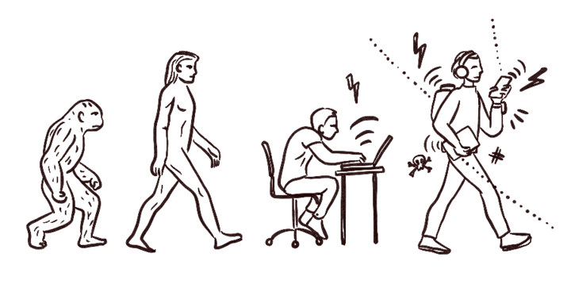

<h1 class="home">Why this course?</h1>

<h3>Because we are convinced that in the digital environment the human factor can be the first vulnerability but also the first security measure.</h3>

Every day the technology becomes more and more powerful and inevitably in some aspects, more complex. it is precisely this complexity that some attackers exploit to deceive their victims and make their own profits. Whether it's credentials to access information systems or your credit card data, the Digital Transformation Team has created this course to increase risk awareness in this digital world.

The course is divided into several episodes where they will be treated through pleasant stories, the dangers that we can meet on the net and how to defend ourselves, because the most important part of data security, we are and with the right knowledge we can defend ourselves effectively.